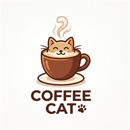

<div align="center">



# Coffee Cat (Kahve Kedisi)

[](https://marketplace.visualstudio.com/items?itemName=CoffeeCatStudio.kahve-kedisi)
[](https://marketplace.visualstudio.com/items?itemName=CoffeeCatStudio.kahve-kedisi)
[](https://marketplace.visualstudio.com/items?itemName=CoffeeCatStudio.kahve-kedisi)
[](LICENSE.txt)

**An interactive, animated cat companion that lives in your VS Code.**  
It tracks your continuous focus sessions, reminds you to stretch and take mindful coffee breaks, and brings charm to your daily coding routine.

[**Install from VS Code Marketplace**](https://marketplace.visualstudio.com/items?itemName=CoffeeCatStudio.kahve-kedisi)

</div>

---

## Highlights & Features

- **Animated Webview Cat Companion:** Dynamic SVG cat that adapts its mood based on your focus duration (*Happy*, *Sleepy*, *Grumpy*, and *Break Time*).
- **Interactive Petting & Web Audio:** Click on the cat to pet it, hear gentle purrs or chime tones, and watch floating hearts fill your daily love meter.
- **Smart Idle Detection:** The focus timer automatically pauses when you step away from your keyboard or attend meetings, preventing unfair break alerts.
- **Break Report & Session Analytics:**
  - Track total breaks taken and sessions snoozed.
  - Review your longest uninterrupted focus streak.
  - Historical archive of previous days' productivity.
- **Dynamic Personality System:** Postpone a break more than twice and the cat turns grumpy, flattening its ears with witty banter.
- **Live Status Bar Companion:** Subtle, real-time indicator at the bottom right displaying focus elapsed time and cat mood.
- **Multi-Language Support (i18n):** Automatically adapts to your VS Code language, supporting **English**, **Turkish**, **Spanish**, **German**, and **Japanese**.
- **Personalized Experience:** Automatically addresses you by your name or custom alias.
- **Clean Aesthetic:** Modern, minimalist color palette (`#FFC6A8` peach and `#741A2F` burgundy) with zero emoji clutter.

---

## Installation

### Via VS Code Marketplace
1. Open VS Code.
2. Press `Ctrl+P` (or `Cmd+P` on macOS), paste the following command, and press **Enter**:
   ```bash
   ext install CoffeeCatStudio.kahve-kedisi
   ```
3. Alternatively, open the Extensions panel (`Ctrl+Shift+X`), search for **"Coffee Cat"**, and click **Install**.

---

## Commands

Open the Command Palette (`Ctrl+Shift+P` on Windows/Linux or `Cmd+Shift+P` on macOS):

| Command | Description |
|---|---|
| `Coffee Cat: Open Break Reminder Panel` | Opens the interactive animated cat dashboard. |
| `Coffee Cat: Break Report & Statistics` | Shows lifetime achievements and daily break history. |
| `Coffee Cat: Take a Break Now` | Quick-starts a 5, 10, or 15-minute rest timer. |
| `Coffee Cat: Reset Timer` | Resets the current continuous work session. |
| `Coffee Cat: Sleep / Pause Cat` | Toggles focus tracking between resting and active. |
| `Coffee Cat: Pet the Cat` | Gives instant affection to your coding companion. |

---

## Extension Settings

Customize your preferences in VS Code Settings (`Ctrl+,` or `Cmd+,`) by searching for **Coffee Cat**:

```json
{
  "kahveKedisi.molaSuresiDakika": 45,
  "kahveKedisi.idleTespitiAktif": true,
  "kahveKedisi.idleSuresiDakika": 5,
  "kahveKedisi.bildirimTuru": "webview",
  "kahveKedisi.sesEfektiAktif": true,
  "kahveKedisi.kisiselIsim": "Developer",
  "kahveKedisi.dil": "otomatik"
}
```

### Configuration Options:
* `kahveKedisi.molaSuresiDakika`: Interval in minutes between break reminders *(Default: 45)*.
* `kahveKedisi.idleTespitiAktif`: Automatically pause tracking when inactive *(Default: true)*.
* `kahveKedisi.idleSuresiDakika`: Inactivity threshold in minutes *(Default: 5)*.
* `kahveKedisi.bildirimTuru`: Notification style: `webview` (interactive modal), `bilgiMesaji` (toast notification), or `herIkisi` (both).
* `kahveKedisi.sesEfektiAktif`: Enable synthesized audio purrs and chimes *(Default: true)*.
* `kahveKedisi.kisiselIsim`: Your custom name for dialogues *(Default: auto-detected OS username)*.
* `kahveKedisi.dil`: Interface language: `otomatik`, `en`, `tr`, `es`, `de`, `ja`.

---

## Contributing

Contributions, feature suggestions, and pull requests are welcome! Feel free to open an issue or submit a pull request on GitHub.

---

## License

MIT License &copy; 2026 CoffeeCatStudio
